# EVE-O-Provit Architektur

**Stand:** November 2025  
**Version:** v0.1.0

## Überblick

EVE-O-Provit ist eine Full-Stack Web-Anwendung für Trading- und Manufacturing-Optimierung in EVE Online, bestehend aus:

- **Frontend:** Next.js 14 (TypeScript, shadcn/ui)
- **Backend:** Go 1.24+ (Fiber Framework)
- **Datenbanken:** PostgreSQL (dynamic data) + SQLite (static SDE)
- **Cache:** Redis (ESI responses)
- **Auth:** EVE SSO (OAuth2)

## System-Architektur


**Dual-Database Architektur:**
- **PostgreSQL:** Dynamische Daten (Market Orders, User Sessions, Character Data)
- **SQLite:** Statische SDE Daten (Items, Ships, Regions, Systems) - Read-Only
- **Beide unabhängig:** Backend nutzt beide parallel via Repository Layer

## Komponenten-Details

### Frontend (Next.js 14)

**Technologie:**

- Framework: Next.js 14 (App Router, Server Components)
- Language: TypeScript
- UI: shadcn/ui (Radix UI + Tailwind CSS)
- State: React Context API
- HTTP Client: Fetch API

**Seiten:**

- `/` - Home / Dashboard
- `/intra-region` - Intra-Region Trading Routes
- `/inventory-sell` - Inventory Sell Optimizer
- `/character` - Character Management
- `/callback` - OAuth Callback Handler

**Schlüssel-Komponenten:**

- `RegionSelect` - Region-Auswahl mit Refresh & Staleness
- `RegionRefreshButton` - Manueller Market Data Refresh
- `RegionStalenessIndicator` - Datenalter-Anzeige (Farb-kodiert)
- `TradingRouteList` - Route-Darstellung mit Profit-Berechnung
- `ItemAutocomplete` - Item-Suche mit ESI Integration
- `AuthProvider` - EVE SSO Session Management

### Backend API (Go/Fiber)

**Technologie:**

- Language: Go 1.24+
- Framework: Fiber v2 (Fast HTTP Router)
- Database: pgx/v5 (PostgreSQL), database/sql (SQLite)
- Cache: go-redis/v9
- ESI Client: eve-esi-client v0.3.0

**Package-Struktur:**

```txt
backend/
├── cmd/api/                    # Entrypoint
├── internal/
│   ├── handlers/              # HTTP Request Handler
│   │   ├── handlers.go        # Market, SDE, Trading Endpoints
│   │   └── trading.go         # Character Ships, Location
│   ├── services/              # Business Logic Layer
│   │   ├── route_calculator.go  # Trading Route Logic
│   │   ├── cargo_service.go   # Cargo Capacity Calculations (Skills + Fitting)
│   │   ├── navigation_service.go # Warp Time & Align Time Calculations
│   │   ├── skills_service.go  # ESI Skills Integration (ADR-014)
│   │   ├── fitting_service.go # Ship Fitting Detection (ADR-015) [Planned]
│   │   └── cache.go          # Market Data Cache (TODO)
│   ├── database/              # Repository Layer
│   │   ├── db.go              # DB Connection Pool
│   │   ├── sde_repository.go  # SDE Queries
│   │   └── market_repository.go # Market Data Queries
│   └── models/
│       └── trading.go         # Domain Models
└── pkg/
    ├── esi/                   # ESI Client Wrapper
    │   └── client.go          # GetRawClient() für BatchFetcher
    ├── evesso/                # OAuth2 Authentication
    └── evedb/                 # SDE Library (migriert von eve-sde)
        ├── cargo/             # Hauling Calculations
        └── navigation/        # Pathfinding & Travel Time
```

**Schlüssel-Handler:**

| Endpoint | Methode | Funktion |
|----------|---------|----------|
| `/health` | GET | Health Check (DB Status) |
| `/health` | GET | Health Check (DB Status) |
| `/version` | GET | API Version Info |
| `/types/:id` | GET | SDE Type Lookup |
| `/sde/regions` | GET | List All Regions |
| `/market/:region/:type` | GET | Market Orders (mit `?refresh=true`) |
| `/market/staleness/:region` | GET | Datenalter-Info |
| `/items/search` | GET | Item Search (Autocomplete) |
| `/calculations/cargo` | POST | Cargo Capacity Calculation |
| `/calculations/warp` | POST | Warp Time Calculation |
| `/trading/routes/calculate` | POST | Trading Routes (Auth) |
| `/character` | GET | Character Info (Auth) |
| `/character/location` | GET | Character Location (Auth) |
| `/character/ship` | GET | Active Ship (Auth) |
| `/character/ships` | GET | Owned Ships (Auth) |
| `/characters/:id/skills` | GET | Character Skills (Auth) |
| `/characters/:id/fitting/:shipTypeId` | GET | Ship Fitting (Auth) |
| `/esi/ui/autopilot/waypoint` | POST | Set Waypoint (Auth) |

### Market Data Fetching (BatchFetcher Pattern)

**Architektur:**

```go
// handlers.go
if refresh {
    config := pagination.DefaultConfig()  // 10 workers, 15s timeout
    fetcher := pagination.NewBatchFetcher(esiClient, config)
    endpoint := "/v1/markets/{regionID}/orders/"
    
    results, err := fetcher.FetchAllPages(ctx, endpoint)
    // → Parallel fetch: 387 Seiten in ~8.7s (The Forge)
    
    // Parse & Store
    for pageNum, data := range results {
        json.Unmarshal(data, &orders)
        // Add regionID & timestamp
    }
    marketRepo.UpsertMarketOrders(ctx, allOrders)
}
```

**Performance:**

- The Forge: 387 Seiten → ~8.7s ESI fetch + ~35s DB write = 45s total
- ~1.193.461 Orders für 18.180 Items
- Worker Pool: 10 parallel goroutines
- Rate Limiting: Innerhalb ESI Limits (300 req/min)

**Quelle:** [eve-esi-client/pkg/pagination](https://github.com/Sternrassler/eve-esi-client)

### Datenbank-Schema

**PostgreSQL (Dynamic Data):**

```sql
-- Market Orders (aktualisiert via ESI)
CREATE TABLE market_orders (
    order_id BIGINT PRIMARY KEY,
    type_id INT NOT NULL,
    region_id INT NOT NULL,
    location_id BIGINT NOT NULL,
    is_buy_order BOOLEAN NOT NULL,
    price NUMERIC(20, 2) NOT NULL,
    volume_remain INT NOT NULL,
    volume_total INT NOT NULL,
    issued TIMESTAMPTZ NOT NULL,
    duration INT NOT NULL,
    fetched_at TIMESTAMPTZ DEFAULT NOW(),
    
    CONSTRAINT market_orders_unique UNIQUE (order_id, region_id)
);

CREATE INDEX idx_market_orders_region_type 
    ON market_orders (region_id, type_id);
CREATE INDEX idx_market_orders_fetched 
    ON market_orders (region_id, fetched_at DESC);
```

**SQLite (Static SDE):**

Verwendet vorgefertigte Views aus eve-sde Projekt:

- `v_item_volumes` - Item Volumen & Preise
- `v_ship_cargo_capacities` - Schiffs-Laderäume
- `v_stargate_graph` - Stargate-Netzwerk für Pathfinding

### Cache-Strategie

**Redis Layer:**

- ESI Response Caching (TTL: 5 Minuten)
- Rate Limit Tracking (sliding window)
- Session Storage (optional, aktuell JWT Cookies)

**TODO:** MarketOrderCache Refactoring zu BatchFetcher Pattern

### Authentication Flow

**EVE SSO (OAuth2):**

```txt
1. User → Frontend: Click "Login with EVE"
2. Frontend → Backend: GET /api/v1/auth/login
3. Backend → EVE SSO: Redirect mit state parameter
4. User authorizes on EVE
5. EVE → Backend: GET /api/v1/auth/callback?code=...&state=...
6. Backend:
   - Exchange code for access token
   - Call ESI /verify
   - Create JWT session (24h TTL)
   - Set HttpOnly cookie
7. Backend → Frontend: Redirect zu /
8. Frontend: Session via /api/v1/auth/verify prüfen
```

**Security:**

- CSRF Protection via state parameter (5min cookie)
- HttpOnly Cookies (XSS Prevention)
- JWT Signature Validation
- Secure flag in Production (HTTPS)

## Daten-Fluss: Market Data Refresh

```mermaid
sequenceDiagram
    actor User
    participant Frontend as Frontend<br/>RegionRefreshButton
    participant Backend as Backend<br/>handlers.GetMarketOrders()
    participant Fetcher as BatchFetcher<br/>FetchAllPages()
    participant Parser as Parse & Enrich
    participant DB as MarketRepository<br/>UpsertMarketOrders()
    participant UI as Frontend UI
    
    User->>Frontend: Click "Refresh"
    Frontend->>Backend: GET /api/v1/market/{region}/34?refresh=true
    Backend->>Backend: Check refresh=true flag
    Backend->>Fetcher: Start fetch
    Fetcher->>Fetcher: Fetch Page 1 → X-Pages: 387
    Fetcher->>Fetcher: Start 10 Workers
    Note over Fetcher: Each Worker: 32-44 pages<br/>Duration: ~8.7s
    Fetcher->>Parser: Raw JSON pages
    Parser->>Parser: Unmarshal JSON per page
    Parser->>Parser: Add regionID + timestamp
    Parser->>DB: Batch UPSERT
    Note over DB: ON CONFLICT UPDATE<br/>Duration: ~35s
    DB-->>Backend: Success
    Backend-->>Frontend: 200 OK
    Frontend->>UI: Toast "✅ Updated in 45s"
    UI->>UI: RegionStalenessIndicator 🟢
```



## Deployment

**Docker Compose (Development):**

```yaml
services:
  postgres:
    image: postgres:16-alpine
    ports: ["5432:5432"]
    volumes: ["postgres-data:/var/lib/postgresql/data"]
    
  redis:
    image: redis:7-alpine
    ports: ["6379:6379"]
    
  api:
    build: ./backend
    ports: ["9001:8080"]
    depends_on: [postgres, redis]
    volumes: ["../eve-sde/data/sqlite:/app/data/sde:ro"]
    
  frontend:
    build: ./frontend
    ports: ["9000:3000"]
    depends_on: [api]
```

**Volumes:**

- PostgreSQL Data: Persistent
- SQLite SDE: Read-Only Mount (von eve-sde Projekt)

**Ports:**

- Frontend: 9000
- Backend: 9001
- PostgreSQL: 5432
- Redis: 6379

## Performance-Metriken

**Market Data Fetching:**

- ESI Parallel Fetch: 8.7s (387 Seiten, 10 Worker)
- Database Write: 35s (1.19M Orders)
- Total User-Facing: ~45s

**Trading Route Calculation:**

- The Forge: < 3s (mit cached market data)
- Pathfinding: < 100ms (Dijkstra auf Stargate-Graph)

**Frontend Load:**

- Initial Page Load: < 1s
- Route Rendering: < 500ms (50 routes)

## Sicherheit

**Best Practices:**

- ✅ No secrets in code (Environment Variables)
- ✅ CSRF Protection (state parameter)
- ✅ HttpOnly Cookies (XSS Prevention)
- ✅ JWT Signature Validation
- ✅ Rate Limiting (ESI + API)
- ✅ SQL Injection Prevention (parameterized queries)
- ✅ Input Validation (type checks, sanitization)

**TODO:**

- [ ] HTTPS in Production (Caddy)
- [ ] Request Rate Limiting (API)
- [ ] Audit Logging (Security Events)

## Skalierung

**Aktuell (Single Instance):**

- Docker Compose auf einem Server
- PostgreSQL Connection Pool (max 25)
- Redis Single Instance

**Zukünftig (Multi-Instance):**

- Load Balancer (Caddy/Nginx)
- Redis Cluster (Session Sharing)
- PostgreSQL Read Replicas (optional)
- Background Worker Queue (Market Refresh)

## Referenzen

- [eve-esi-client](https://github.com/Sternrassler/eve-esi-client) - ESI Client Library
- [eve-sde](https://github.com/Sternrassler/eve-sde) - SDE Database Tools
- [EVE ESI Documentation](https://esi.evetech.net/ui/)
- [EVE SSO Guide](https://docs.esi.evetech.net/docs/sso/)
