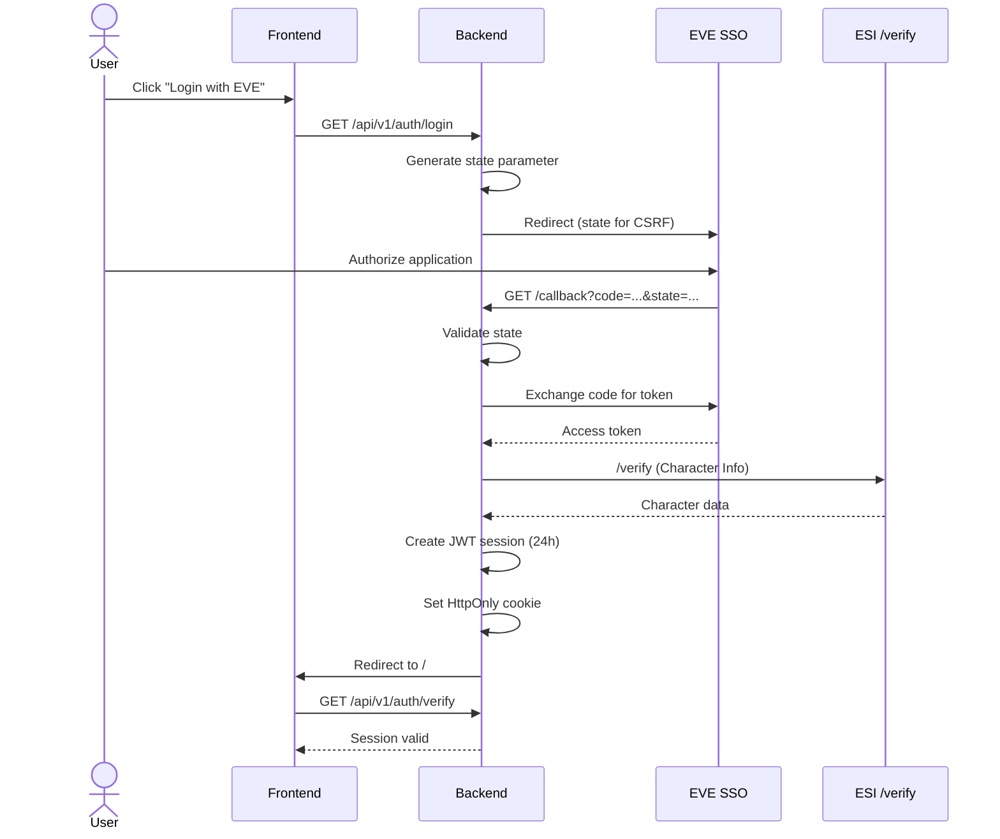

# EVE SSO Integration

OAuth2 Authentication mit EVE Online Single Sign-On (SSO).

## Architektur

**Flow:** Frontend PKCE (ADR-004) → Backend JWT Sessions  
**Token Storage:** HttpOnly Cookies (24h TTL)  
**Scopes:** `esi-location.*`, `esi-skills.*`, `esi-assets.*`, `esi-ui.write_waypoint.*`

## Setup

### 1. EVE Developer Application

1. [EVE Developer Portal](https://developers.eveonline.com/) → Create Application
2. **Client ID:** `0828b4bcd20242aeb9b8be10f5451094`
3. **Callback URL:** `http://localhost:9001/api/v1/auth/callback` (Backend Port!)
4. **Scopes:** Siehe [Required Scopes](#required-scopes)

### 2. Backend Environment

```bash
# backend/.env
EVE_CLIENT_ID=0828b4bcd20242aeb9b8be10f5451094
EVE_CLIENT_SECRET=<your-secret>  # Von EVE Developer Portal
EVE_CALLBACK_URL=http://localhost:9001/api/v1/auth/callback
JWT_SECRET=<generate-random-secret>  # openssl rand -base64 32
```

### 3. Frontend Environment

```bash
# frontend/.env.local
NEXT_PUBLIC_API_URL=http://localhost:9001
```

## Authentication Flow



## API Endpoints

### Public

- `GET /api/v1/auth/login` - Initiate EVE SSO
- `GET /api/v1/auth/callback` - OAuth callback handler

### Protected (requires JWT cookie)

- `GET /api/v1/auth/verify` - Verify session
- `POST /api/v1/auth/logout` - Destroy session
- `GET /api/v1/character` - Character info
- `GET /api/v1/character/location` - Current location
- `GET /api/v1/character/ship` - Active ship
- `GET /api/v1/character/ships` - Owned ships

## Required Scopes

```
esi-location.read_location.v1       # Character location
esi-location.read_ship_type.v1      # Active ship
esi-skills.read_skills.v1           # Skills (cargo bonuses)
esi-assets.read_assets.v1           # Ships & items
esi-fittings.read_fittings.v1       # Ship fittings
esi-ui.write_waypoint.v1            # Autopilot waypoints
```

## Security

- ✅ CSRF Protection (state parameter, 5min cookie)
- ✅ HttpOnly Cookies (XSS Prevention)
- ✅ JWT Signature Validation
- ✅ Secure flag in Production (HTTPS)
- ✅ Token Refresh (automatisch bei < 5min Restlaufzeit)

## Testing

```bash
# Login Flow
curl -I http://localhost:9001/api/v1/auth/login
# → 302 Redirect to login.eveonline.com

# Verify Session (mit Cookie)
curl -b cookies.txt http://localhost:9001/api/v1/auth/verify
# → {"authenticated": true, "character": {...}}

# Character Location (mit Cookie)
curl -b cookies.txt http://localhost:9001/api/v1/character/location
# → {"solar_system_id": 30000142, ...}
```

## Troubleshooting

**"Invalid state parameter"**  
→ State cookie expired (5min). Neustart des Login-Flows.

**"Unauthorized" bei /character/*"**  
→ JWT Token expired (24h). Re-Login erforderlich.

**Callback URL Mismatch**  
→ Prüfe EVE Developer Portal Callback URL (muss exakt matchen).

## Weiterführende Docs

- [EVE SSO Guide](https://docs.esi.evetech.net/docs/sso/)
- [ADR-004](adr/ADR-004-frontend-oauth-pkce.md) - PKCE Architecture Decision
