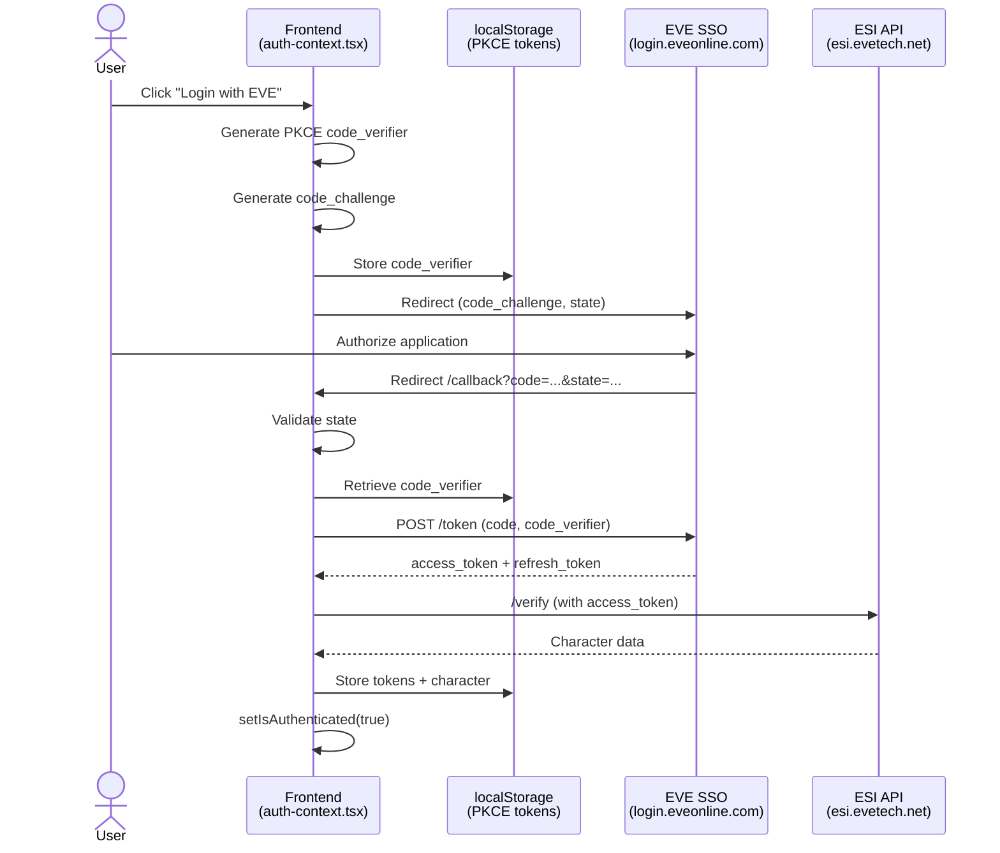

# EVE SSO Integration

OAuth2 Authentication mit EVE Online Single Sign-On (SSO).

## Architektur

**Flow:** Frontend-only PKCE (ADR-004) - Kein Backend involviert!  
**Token Storage:** Browser localStorage (PKCE code_verifier)  
**Scopes:** `esi-location.*`, `esi-skills.*`, `esi-assets.*`, `esi-ui.write_waypoint.*`

## Setup

### 1. EVE Developer Application

1. [EVE Developer Portal](https://developers.eveonline.com/) → Create Application
2. **Client ID:** `0828b4bcd20242aeb9b8be10f5451094`
3. **Callback URL:** `http://localhost:9000/callback` (Frontend Port!)
4. **Connection Type:** Authentication & API Access
5. **Scopes:** Siehe [Required Scopes](#required-scopes)

**Wichtig:** Kein Client Secret benötigt (PKCE nutzt code_verifier statt Secret)

### 2. Frontend Environment

```bash
# frontend/.env.local
NEXT_PUBLIC_EVE_CLIENT_ID=0828b4bcd20242aeb9b8be10f5451094
NEXT_PUBLIC_EVE_CALLBACK_URL=http://localhost:9000/callback
```

## Authentication Flow



**PKCE-Flow (Frontend-only):**
1. Frontend generiert `code_verifier` (random)
2. Frontend berechnet `code_challenge` = SHA256(code_verifier)
3. EVE SSO erhält `code_challenge` (nicht verifier!)
4. Nach User-Authorize: Frontend tauscht `code` + `code_verifier` gegen Token
5. Kein Backend Secret benötigt - PKCE verhindert Code Interception

## API Endpoints

### Frontend Routes

- `/callback` - OAuth2 Callback Handler (Next.js Page)

### Backend Endpoints (nur Token-Validierung)

**Protected Endpoints** nutzen `evesso.AuthMiddleware`:
- Extrahiert `Authorization: Bearer <token>` Header
- Validiert Token via ESI `/verify`
- Keine Session-Verwaltung im Backend
- Stateless Authentication

## Required Scopes

```
esi-location.read_location.v1       # Character location
esi-location.read_ship_type.v1      # Active ship
esi-skills.read_skills.v1           # Skills (cargo bonuses)
esi-assets.read_assets.v1           # Ships & items
esi-fittings.read_fittings.v1       # Ship fittings
esi-ui.write_waypoint.v1            # Autopilot waypoints
```

## Security

- ✅ PKCE (Proof Key for Code Exchange) - Verhindert Code Interception
- ✅ State Parameter (CSRF Protection)
- ✅ Tokens in localStorage (Frontend-only)
- ✅ Auto-Refresh (bei < 5min Restlaufzeit)
- ✅ Stateless Backend (keine Sessions)

## Testing

```bash
# Prüfe Frontend Auth Context
# Browser Console (http://localhost:9000)
localStorage.getItem('eve_access_token')
localStorage.getItem('eve_character')

# Backend API Call mit Token
curl -H "Authorization: Bearer <token>" \
  http://localhost:9001/api/v1/character/location
```

## Troubleshooting

**"State mismatch"**  
→ State cookie/localStorage nicht synchron. Browser-Cache leeren.

**"Unauthorized" bei Backend-Calls**  
→ Access Token expired. Frontend refresh automatisch (<5min).

**Callback URL Mismatch**  
→ EVE Developer Portal: Callback muss **Frontend** URL sein (Port 9000, nicht 9001)!

## Weiterführende Docs

- [EVE SSO Guide](https://docs.esi.evetech.net/docs/sso/)
- [ADR-004](adr/ADR-004-frontend-oauth-pkce.md) - PKCE Architecture Decision
