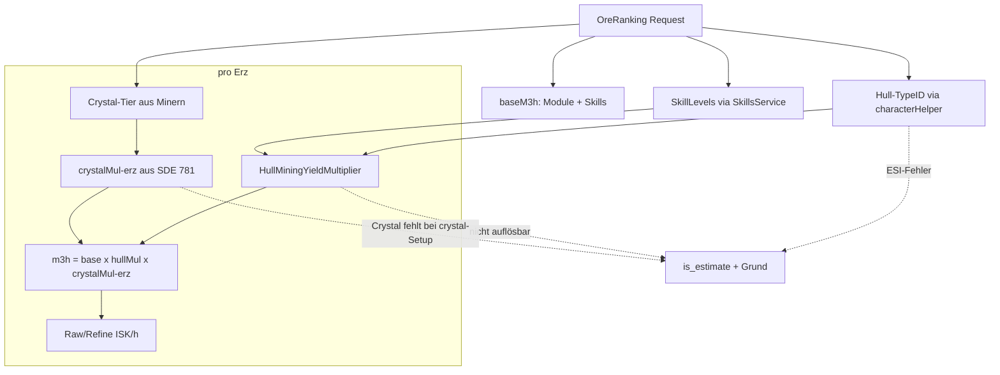

# Mining ISK/h: Hull-Rollenboni + Erz-Crystals — Design

**Datum:** 2026-06-01
**Status:** Approved (Design)
**Kontext:** Follow-up zum Mining-Rechner (v0.20.0/#154). Die ISK/h-Zahl ist
heute eine **skills-only Untergrenze** — Schiffs-Rollenboni (Mining Barge/
Exhumer/Frigates/…) und Erz-spezifische Mining-Crystals fehlen. Dieses Feature
macht die Zahl exakt, soweit aus der SDE auflösbar.

---

## 1. Ziel & Nicht-Ziel

**Ziel:** Die m³/h und damit die ISK/h des Mining-Rechners spiegeln das
tatsächliche aktuelle Schiff wider — inkl. Hull-Mining-Yield-Bonus (generisch
aus SDE-Dogma, alle Hulls) und best-case Erz-Crystal pro Erz.

**Nicht-Ziel:** Das Roh-vs-Refine-**Verdict** und die Preis-/Reprocessing-Logik
bleiben unangetastet. Ice Harvesting, Gas, Moon-Drilling sind nicht im Scope
(nur Erz-Mining, Attribut `miningAmount` = 77).

---

## 2. Rechenmodell

Heute (Ist):

```
m3h = MiningRateM3PerHour(modules, {Mining, Astrogeology}, crystalMul=1.0)
RawISKPerHour    = m3h × rawNetPerM3[erz]
RefineISKPerHour = m3h × refineNetPerM3[erz]
```

`m3h` ist hull-agnostisch und für alle Erze identisch; das Ranking hängt nur an
`netPerM3`.

Neu (Soll) — rein multiplikativ, pro Erz:

```
baseM3h          = MiningRateM3PerHour(modules, {Mining, Astrogeology}, crystalMul=1.0)   // unverändert
hullMul          = HullMiningYieldMultiplier(hullTypeID, skillLevels)                      // hull-weit, erz-unabhängig
m3h[erz]         = baseM3h × hullMul × crystalMul[erz]
RawISKPerHour    = m3h[erz] × rawNetPerM3[erz]
RefineISKPerHour = m3h[erz] × refineNetPerM3[erz]
```

**Auswirkungen:**
- `hullMul` skaliert alle Erze gleich → **Ranking unverändert** durch den Hull-Bonus.
- `crystalMul[erz]` ist erz-spezifisch → kann das **Ranking umsortieren**. Das ist
  gewollt: es bildet echte Yield-Unterschiede zwischen Erzen ab.
- Das **Verdict** (roh vs. refine) hängt weiterhin ausschließlich an `netPerM3` und
  ist von beiden Multiplikatoren unberührt.

`NoMiningSetup` bleibt an `baseM3h == 0` gebunden (keine Mining-Module gefittet).

---

## 3. Komponenten

### 3.1 Hull-Bonus — generisch aus SDE-Dogma

Neue Funktion in `pkg/evedb/mining`:

```go
// HullMiningYieldMultiplier liefert den multiplikativen Erz-Mining-Yield-Bonus
// des Hulls (Rollenbonus + per-Skill-Level-Bonus). resolved=false, wenn ein
// Mining-Yield-Effekt des Hulls nicht vollständig aufgelöst werden konnte
// (z. B. referenzierter Skill-Level fehlt) — der Aufrufer markiert die Zeile
// dann als Estimate statt still 1.0 zu verwenden.
func HullMiningYieldMultiplier(db *sql.DB, hullTypeID int64, skillLevels map[int64]int) (mult float64, resolved bool, err error)
```

Algorithmus:
1. `typeDogma` des Hulls laden → `dogmaAttributes` (Werte) + `dogmaEffects` (IDs).
   Reuse des bestehenden Loaders aus `pkg/evedb/dogma` (`GetModuleEffects`-Muster,
   das `typeDogma` + `dogmaEffects.modifierInfo` parst).
2. Für jeden Effekt jeden `ModifierInfo` betrachten, der das Mining-Yield-Attribut
   (`modifiedAttributeID == 77`) modifiziert (Domain `shipID`).
3. Pro Modifier:
   - `value = hullAttribute[modifyingAttributeID]` (per-Level-Bonuswert des Hulls).
   - Skill-gebunden (`LocationRequiredSkillModifier` mit `skillTypeID`) →
     `level = skillLevels[skillTypeID]`; reiner Rollenbonus → `level = 1`.
   - `postPercent` (Operation): `mult *= (1 + value/100 × level)`.
4. Rollen-/Schiffsboni sind **nicht** stacking-penalized → Produkt aller Modifier.
5. Hat das Hull **gar keine** Mining-Yield-Effekte → `mult = 1.0, resolved = true`
   (korrekt: das Schiff hat echt keinen Mining-Bonus — kein Fallback).
   Existiert ein Effekt, der nicht vollständig auflösbar ist → `resolved = false`.

> **Keine Fallbacks:** `mult = 1.0` wird ausschließlich zurückgegeben, wenn es
> faktisch korrekt ist (kein Bonus vorhanden). Ein nicht auflösbarer Bonus
> erzeugt `resolved = false`, niemals ein stilles 1.0.

### 3.2 Crystal-Bonus — best-case pro Erz

Neue Funktionalität in `pkg/evedb/mining` + eine kuratierte Erz→Crystal-Map.

- **Crystal-Fähigkeit & Tier** werden aus den gefitteten Minern abgeleitet:
  - Miner-Gruppe crystal-fähig (Modulated Strip Miner / Modulated Deep Core
    Strip Miner / Deep Core Mining Laser) → crystal-fähig; sonst nicht.
  - Mindestens ein **T2**-modulierter Miner gefittet → Tier T2, sonst T1.
  - Kein crystal-fähiger Miner → `crystalMul = 1.0` für **alle** Erze
    (korrekt: Strip Miner I / Miner I/II nutzen keine Crystals — kein Fallback).
- **Pro Erz** das passende Crystal bestimmen (Erz-Basisname → „<Erz> Mining
  Crystal I/II"; Erz-Varianten teilen das Basis-Crystal). Multiplikator =
  SDE-Attribut `specializationAsteroidYieldMultiplier` (781) des Crystal-Typs.
- Erz→Crystal-Map ist **kuratiert/namensbasiert** (analog zur bestehenden
  kuratierten Erz→Sec-Map; deckt SDE-Lücken in der Erz↔Crystal-Beziehung ab).

> **Keine Fallbacks:** Existiert für ein crystal-fähiges Setup zu einem Erz
> **kein** auflösbares Crystal (Map-Lücke / SDE-Attribut fehlt), wird `crystalMul`
> **nicht** still auf 1.0 gesetzt — die Zeile wird als Estimate markiert.
> `crystalMul = 1.0` ist nur gültig, wenn das Setup gar keine Crystals nutzt.

### 3.3 Skills-Erweiterung

`HullMiningYieldMultiplier` braucht Levels beliebiger Skill-IDs (je nachdem,
welche Skills die Hull-Boni referenzieren). Der Skills-Provider des Mining-
Service wird um ein Feld `SkillLevels map[int64]int` (skillTypeID → aktives
Level) erweitert. Der `SkillsService` iteriert die Char-Skills bereits — das
Feld wird dort befüllt. `Mining`/`Astrogeology` bleiben wie gehabt.

### 3.4 Hull-TypeID

Der Mining-Service holt die aktuelle Hull-TypeID über das bereits injizierte
`characterHelper.GetActiveShipTypeID(ctx, characterID, accessToken)`.
Schlägt dieser ESI-Call fehl, ist der Hull-Bonus nicht berechenbar →
**fail-loud**: die Zeilen werden als Estimate markiert (mit Grund
„aktuelles Schiff nicht abrufbar"), nicht still ohne Hull-Bonus gerechnet.

---

## 4. Datenfluss & Fehlerverhalten (fail-loud, keine stillen Fallbacks)



Der bisherige **pauschale** UI-Hinweis („ISK/h ist skills-basierte Untergrenze")
wird durch einen **per-Zeile**-Marker ersetzt:
- Voll aufgelöste Zeilen sind jetzt **exakt** (kein Marker).
- Nur Zeilen mit nicht auflösbarem Hull-Bonus oder fehlendem Crystal tragen
  `is_estimate = true` + kurzen Grund.

Kein neuer ESI-Scope, kein Deploy-Gate.

### Response-Schema (Ergänzung `OreRankRow`)

| Feld | Typ | Bedeutung |
|------|-----|-----------|
| `hull_yield_multiplier` | float | angewandter Hull-Bonus (z. B. 1.20). 1.0 = kein Bonus. |
| `crystal_multiplier` | float | angewandtes Crystal pro Erz. 1.0 = keine Crystals genutzt. |
| `is_estimate` | bool | true, wenn Hull-Bonus/Crystal nicht voll auflösbar war. |
| `estimate_reason` | string (omitempty) | kurzer Grund, nur wenn `is_estimate`. |

`hull_yield_multiplier` ist erz-unabhängig (in jeder Zeile gleich), wird der
Einfachheit halber aber pro Zeile mitgeliefert; das UI kann es einmal anzeigen.

---

## 5. Tests (TDD)

**`pkg/evedb/mining` (gegen reale SDE, `SDE_DB_PATH` / `GOWORK=off`):**
- `HullMiningYieldMultiplier`: tabellengetrieben für mehrere Hulls
  (z. B. Hulk, Covetor, Venture, ein Nicht-Mining-Hull) × Skill-Levels;
  Erwartung gegen bekannte In-Game-Bonuswerte. Nicht-Mining-Hull → `1.0, resolved=true`.
- Crystal: `crystalMul` für Veldspar (T1 vs T2) gegen SDE-Attribut 781;
  crystal-fähig vs. nicht-crystal-Miner; Map-Lücke → kein stilles 1.0.

**Service (`mining_service_test.go`):**
- `m3h[erz] == baseM3h × hullMul × crystalMul[erz]`.
- `is_estimate`/`estimate_reason` gesetzt bei unbekanntem Hull-Effekt bzw.
  fehlendem Crystal bei crystal-Setup; nicht gesetzt im Normalfall.
- Verdict/Ranking-Regression: Hull-Bonus reordert **nicht**; gleicher Verdict
  wie vor dem Feature.

**Web (`OreRankingTable.test.tsx`) & Flutter (`mining_*_test.dart`):**
- Estimate-Marker wird pro Zeile gerendert (statt pauschalem Hinweis);
  voll aufgelöste Zeile trägt keinen Marker.
- Neue Felder parsen null/float-robust.

---

## 6. Betroffene Dateien (Überblick)

- `backend/pkg/evedb/mining/` — `HullMiningYieldMultiplier`, Crystal-Logik,
  Erz→Crystal-Map (+ Tests).
- `backend/internal/services/skills_service.go` — `SkillLevels map[int64]int`.
- `backend/internal/services/mining_service.go` — Hull-TypeID holen, per-Erz-m³/h,
  Estimate-Marker; Provider-Interface ggf. erweitern.
- `backend/internal/models/mining.go` — `OreRankRow`-Felder.
- `frontend/src/types/trading.ts` + `OreRankingTable.tsx` — Felder + per-Zeile-Marker.
- `app/lib/api/mining_models.dart` + `features/mining/mining_screen.dart` — dito.

Kein neuer ESI-Scope, keine `deployments`-Änderung.
